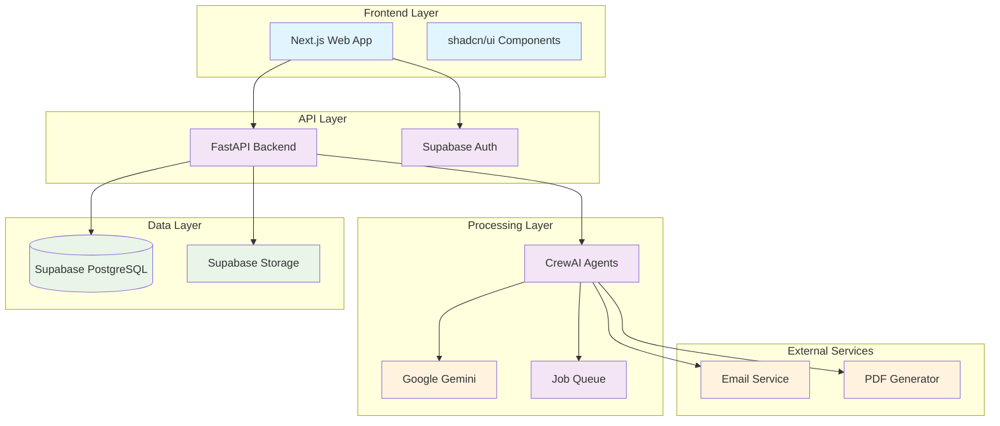

# Design Document

## Overview

The AI CV Agent is a multi-tier application that combines modern web technologies with intelligent AI agents to provide automated CV generation and job-tailored resume creation. The system uses a microservices architecture with a Next.js frontend, Python FastAPI backend with CrewAI orchestration, Supabase for data persistence and authentication, and Google Gemini for AI-powered content generation.

The design prioritizes security through row-level security (RLS), scalability through background job processing, and user experience through real-time updates and intuitive interfaces.

## Architecture

### High-Level Architecture



### Data Flow

**CV Building Flow:**
1. User uploads PDF or fills forms → Frontend validation
2. API receives request → Creates job in queue
3. ParseAgent extracts/normalizes data → Stores in profile tables
4. StylistAgent generates CV → QAAgent validates
5. PDF rendered → Stored in Supabase Storage
6. DeliveryAgent sends email → User receives download link

**Job Tailoring Flow:**
1. User provides job description → JDAnalysisAgent extracts requirements
2. TailorAgent matches profile to job requirements
3. Content generation → QA validation → PDF rendering
4. Secure storage → Email delivery

## Components and Interfaces

### Frontend Components (Next.js + shadcn/ui)

#### Core Pages
- **Dashboard**: Job status, recent documents, quick actions
- **Profile Builder**: Multi-step forms for all profile sections including additional details
- **Upload Interface**: Drag-and-drop CV upload with parsing preview
- **Tailor Interface**: Job description input and tailoring options
- **Document Vault**: Generated CV management and downloads

#### Key UI Components
```typescript
// Profile form with additional details field
interface ProfileFormData {
  personal: PersonalInfo;
  education: Education[];
  experience: Experience[];
  skills: Skill[];
  certifications: Certification[];
  referees: Referee[];
  additionalDetails: string; // Free-form text field for any other information
}

// Job status component with real-time updates
interface JobStatus {
  id: string;
  type: 'build_cv' | 'tailor_cv';
  status: 'queued' | 'running' | 'succeeded' | 'failed';
  progress: number;
  error?: string;
}
```

### Backend API (FastAPI)

#### Core Endpoints
```python
# Job management
POST /api/jobs - Create CV generation or tailoring job
GET /api/jobs/{job_id} - Get job status and results
GET /api/jobs - List user jobs with pagination

# Profile management  
GET /api/profile - Get complete user profile
PUT /api/profile - Update profile sections (batch operation)
POST /api/profile/parse - Parse uploaded CV and return extracted data

# Document management
GET /api/documents - List generated documents
GET /api/documents/{doc_id}/download - Get signed download URL
DELETE /api/documents/{doc_id} - Delete document

# Job description processing
POST /api/jd/analyze - Analyze job description text or URL
```

#### Authentication & Authorization
- Supabase JWT tokens for authentication
- Row-level security policies enforce data isolation
- API middleware validates tokens and extracts user context

### AI Agent System (CrewAI)

#### Agent Definitions
```python
class CVAgentCrew:
    def __init__(self):
        self.intake_agent = IntakeAgent()      # Input validation and job setup
        self.parse_agent = ParseAgent()        # PDF extraction and field mapping
        self.schema_agent = SchemaAgent()      # Data normalization and validation
        self.jd_analysis_agent = JDAnalysisAgent()  # Job requirement extraction
        self.tailor_agent = TailorAgent()      # Content customization
        self.stylist_agent = StylistAgent()    # Template application and formatting
        self.qa_agent = QAAgent()              # Quality assurance and validation
        self.delivery_agent = DeliveryAgent()  # PDF generation and email delivery
```

#### Task Orchestration
```python
# CV Building workflow
cv_build_tasks = [
    Task(
        description="Parse uploaded CV and extract structured data",
        agent=parse_agent,
        expected_output="Structured profile data with confidence scores"
    ),
    Task(
        description="Normalize and validate profile data",
        agent=schema_agent,
        expected_output="Clean, validated profile matching database schema"
    ),
    Task(
        description="Generate ATS-friendly CV using selected template",
        agent=stylist_agent,
        expected_output="Formatted CV content ready for PDF generation"
    ),
    Task(
        description="Quality check and final validation",
        agent=qa_agent,
        expected_output="Validated CV with quality metrics"
    ),
    Task(
        description="Generate PDF and deliver to user",
        agent=delivery_agent,
        expected_output="PDF stored and email sent with download link"
    )
]
```

## Data Models

### Core Profile Schema
```sql
-- Enhanced profiles table with additional details
CREATE TABLE core.profiles (
  user_id uuid PRIMARY KEY REFERENCES core.users(id) ON DELETE CASCADE,
  headline text,
  summary text,
  linkedin_url text,
  website_url text,
  additional_details text,  -- Free-form field for any other user information
  last_updated timestamptz DEFAULT now()
);

-- Experience with enhanced tracking
CREATE TABLE core.experience (
  id bigserial PRIMARY KEY,
  user_id uuid REFERENCES core.users(id) ON DELETE CASCADE,
  title text NOT NULL,
  company text,
  location text,
  start_date date,
  end_date date,
  currently_employed boolean DEFAULT false,
  achievements text[],
  description text,
  additional_notes text  -- For context that doesn't fit standard fields
);

-- Skills with proficiency and context
CREATE TABLE core.skills (
  id bigserial PRIMARY KEY,
  user_id uuid REFERENCES core.users(id) ON DELETE CASCADE,
  name text NOT NULL,
  level text CHECK (level IN ('beginner','intermediate','advanced','expert')),
  category text,
  years_experience integer,
  context text  -- How/where skill was acquired or used
);
```

### Job Processing Schema
```sql
-- Enhanced jobs table with detailed tracking
CREATE TABLE gen.jobs (
  id uuid PRIMARY KEY DEFAULT gen_random_uuid(),
  user_id uuid REFERENCES core.users(id) ON DELETE CASCADE,
  type text CHECK (type IN ('build_cv','tailor_cv')) NOT NULL,
  jd_text text,
  jd_url text,
  additional_quals text,
  template_key text DEFAULT 'modern_one_page',
  status text DEFAULT 'queued',
  progress integer DEFAULT 0,
  current_step text,
  error text,
  metadata jsonb,  -- Store agent outputs and intermediate results
  created_at timestamptz DEFAULT now(),
  started_at timestamptz,
  finished_at timestamptz
);
```

## Error Handling

### Error Categories and Responses
```python
class CVAgentError(Exception):
    """Base exception for CV Agent errors"""
    pass

class ParseError(CVAgentError):
    """PDF parsing or data extraction failed"""
    pass

class ValidationError(CVAgentError):
    """Data validation failed"""
    pass

class GenerationError(CVAgentError):
    """CV generation failed"""
    pass

class ExternalServiceError(CVAgentError):
    """External service (LLM, email, etc.) failed"""
    pass

# Error handling middleware
@app.exception_handler(CVAgentError)
async def cv_agent_error_handler(request: Request, exc: CVAgentError):
    return JSONResponse(
        status_code=400,
        content={
            "error": exc.__class__.__name__,
            "message": str(exc),
            "request_id": request.state.request_id
        }
    )
```

### Retry and Recovery Strategies
- **Network errors**: Exponential backoff with jitter (3 retries)
- **LLM timeouts**: Circuit breaker pattern with fallback responses
- **PDF generation failures**: Template fallback and simplified formatting
- **Email delivery**: Queue for retry with dead letter handling

## Testing Strategy

### Unit Testing
```python
# Agent testing with mocked dependencies
def test_parse_agent_cv_extraction():
    agent = ParseAgent()
    mock_pdf_content = "John Doe\nSoftware Engineer\n..."
    
    result = agent.extract_profile_data(mock_pdf_content)
    
    assert result.personal_info.name == "John Doe"
    assert result.experience[0].title == "Software Engineer"

# Profile validation testing
def test_profile_additional_details_storage():
    profile_data = {
        "headline": "Senior Developer",
        "additional_details": "Available for remote work, willing to relocate"
    }
    
    profile = create_profile(user_id, profile_data)
    assert profile.additional_details == profile_data["additional_details"]
```

### Integration Testing
```python
# End-to-end CV generation flow
async def test_cv_generation_flow():
    # Create user and profile
    user = await create_test_user()
    profile = await create_test_profile(user.id, include_additional_details=True)
    
    # Start CV generation job
    job = await create_cv_job(user.id, template="modern_one_page")
    
    # Wait for completion
    result = await wait_for_job_completion(job.id)
    
    assert result.status == "succeeded"
    assert result.document_url is not None
    
    # Verify PDF was generated and stored
    document = await get_document(result.document_id)
    assert document.bytes > 0
```

### Security Testing
```python
# Row-level security validation
async def test_profile_isolation():
    user1 = await create_test_user()
    user2 = await create_test_user()
    
    profile1 = await create_profile(user1.id, {"name": "User 1"})
    
    # User 2 should not be able to access User 1's profile
    with pytest.raises(PermissionError):
        await get_profile(profile1.id, requesting_user=user2.id)
```

This design provides a robust, scalable foundation for the AI CV Agent system while ensuring security, reliability, and excellent user experience. The inclusion of the additional details field allows users to add any supplementary information that doesn't fit into standard profile categories.